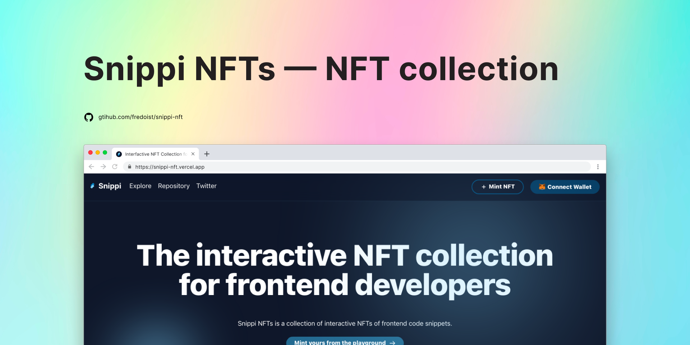
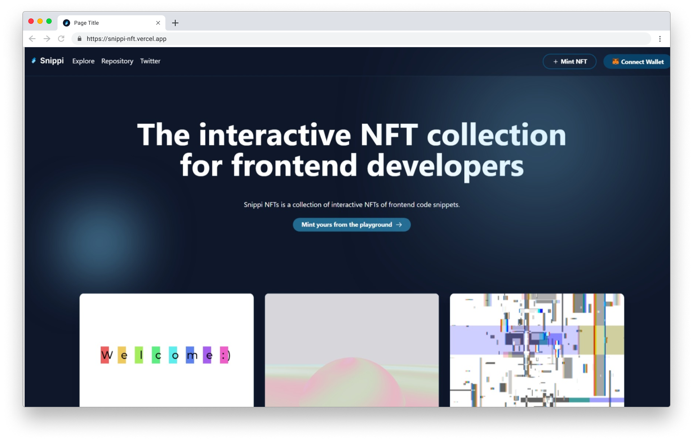
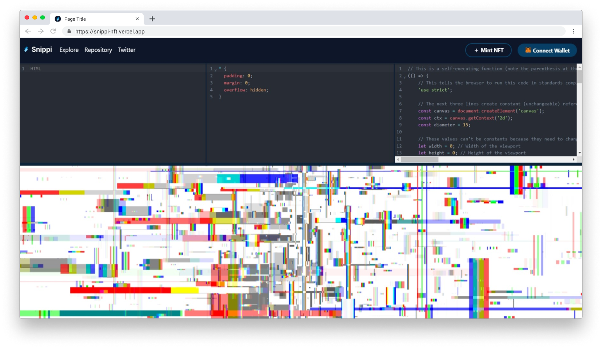
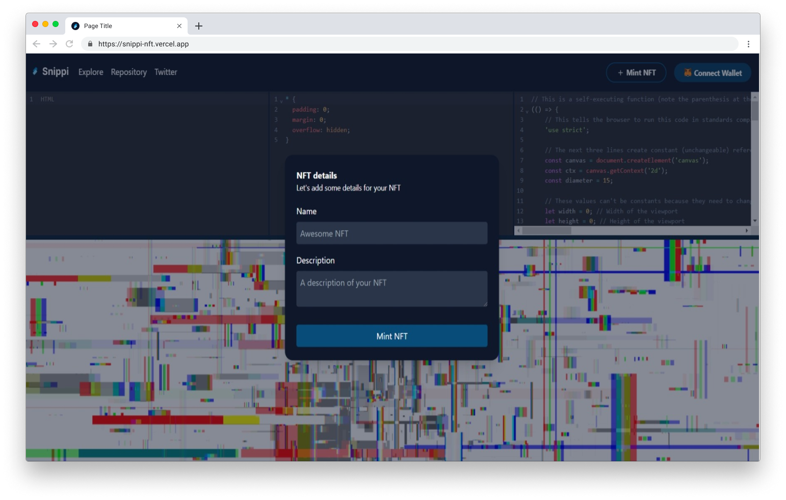
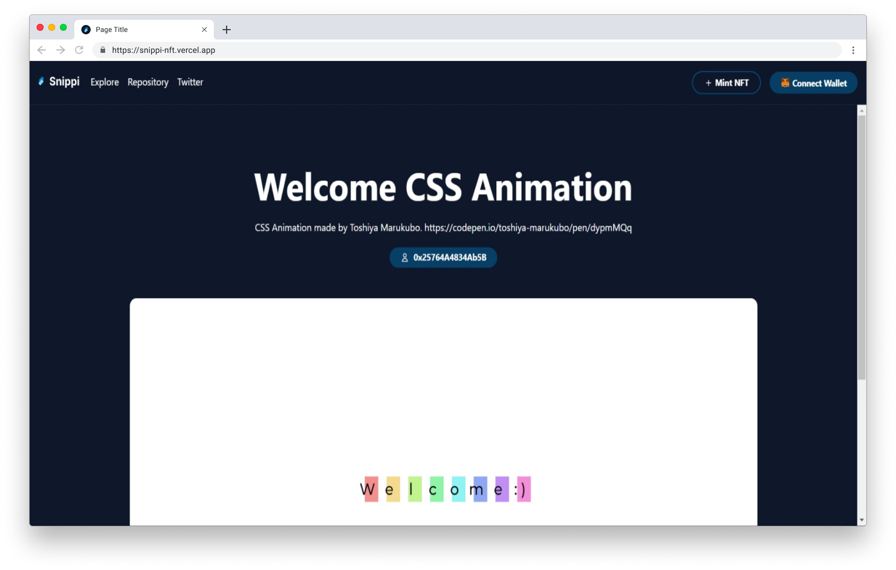

[![Contributors][contributors-shield]][contributors-url]
[![Forks][forks-shield]][forks-url] [![Stargazers][stars-shield]][stars-url]
[![Issues][issues-shield]][issues-url]
[![MIT License][license-shield]][license-url]
[![LinkedIn][linkedin-shield]][linkedin-url]

<br />
<p align="center">
  
</p>

<h3 align="center">Snippi NFTs</h3>
<p align="center">An NFT collection and frontend code playground to mint code snippets as NFTs.</p>

<p align="center">
  <br />
  <a href="https://fredoist.hashnode.dev/snippi-nfts-the-interactive-nft-collection-for-frontend-developers"><strong>The Making Of Snippi NFTs</strong></a>
  <br />
  <br />
  <a href="https://snippi-nft.vercel.app">View Demo</a>
  ⁕
  <a href="https://github.com/fredoist/snippi-nft/issues">Report Bug</a>
  ⁕
  <a href="https://github.com/fredoist/snippi-nft/issues">Request Feature</a>
</p>

# :memo: About the project


<br />
Snippi NTFs is a collection of interactive NFTs that you can create with code. It's a custom web app built with Next.js that integrates a frontend code playground where you can build interactive NFTs. The generated HTML file then gets minted to the blockchain of Polygon Network and is rendered in the web app using iframes.

# :building_construction: Built with


### :bricks: Installation

1. Clone the repo
   ```sh
   git clone https://github.com/fredoist/snippi-nft.git
   ```
2. Install NPM packages
   ```sh
   npm install
   ```
3. Rename `.env.example` file to `.env.local` and add your variables

4. Run your local dev server by running `npm run dev`

# :camera_flash: Screenshots

<p align="center">






</p>

## :bug: Contributing

Contributions are what make the open source community such an amazing place to
learn, inspire, and create. Any contributions you make are **greatly
appreciated**.

1. Fork the Project
2. Create your Feature Branch (`git checkout -b feature/AmazingFeature`)
3. Commit your Changes (`git commit -m 'Add some AmazingFeature'`)
4. Push to the Branch (`git push origin feature/AmazingFeature`)
5. Open a Pull Request

<!-- LICENSE -->

## :page_facing_up: License

Distributed under the MIT License. See `LICENSE` for more information.

<!-- CONTACT -->

## Contact

Freddy González - [@fredoist](https://twitter.com/fredoist)

Project Link:
[https://github.com/fredoist/snippi-nft](https://github.com/fredoist/snippi-nft)

[contributors-shield]:
  https://img.shields.io/github/contributors/fredoist/snippi-nft.svg?style=for-the-badge
[contributors-url]: https://github.com/fredoist/snippi-nft/graphs/contributors
[forks-shield]:
  https://img.shields.io/github/forks/fredoist/snippi-nft.svg?style=for-the-badge
[forks-url]: https://github.com/fredoist/snippi-nft/network/members
[stars-shield]:
  https://img.shields.io/github/stars/fredoist/snippi-nft.svg?style=for-the-badge
[stars-url]: https://github.com/fredoist/snippi-nft/stargazers
[issues-shield]:
  https://img.shields.io/github/issues/fredoist/snippi-nft.svg?style=for-the-badge
[issues-url]: https://github.com/fredoist/snippi-nft/issues
[license-shield]:
  https://img.shields.io/github/license/fredoist/snippi-nft.svg?style=for-the-badge
[license-url]: https://github.com/fredoist/snippi-nft/blob/master/LICENSE.txt
[linkedin-shield]:
  https://img.shields.io/badge/-LinkedIn-black.svg?style=for-the-badge&logo=linkedin&colorB=555
[linkedin-url]: https://linkedin.com/in/fredoist
